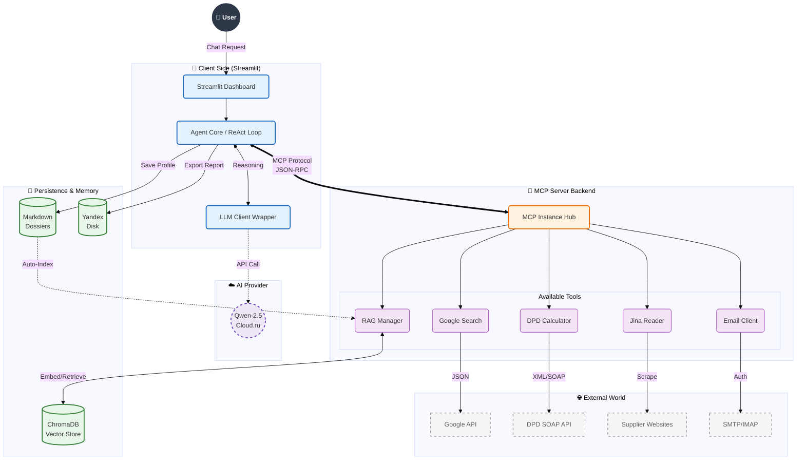

# 🏢 AI Procurement Agent (MCP Architecture)

[](https://cloud.ru)
[](https://www.python.org/)
[](https://modelcontextprotocol.io/)
[](https://www.docker.com/)

> **An autonomous multi-agent system designed to automate the procurement supply chain.**  
> Built using the **Model Context Protocol (MCP)**, this agent integrates Large Language Models (LLMs) with legacy enterprise APIs (SOAP), real-time web search, and a persistent RAG memory system.

---

## 🚀 Project Overview

This project was developed during the Cloud.ru Hackathon (**3rd Place Winner 🏆**). It solves a complex business problem: automating supplier discovery, logistics calculation, and data management.

Unlike standard chatbots, this agent operates on a **Client-Server architecture** using the **Model Context Protocol (MCP)** by Anthropic. This allows the LLM to securely call external tools, execute code, and maintain state across sessions.

### ✨ Key Capabilities
*   **🧠 Hybrid RAG Memory:** The agent remembers every supplier found. It prioritizes its local knowledge base (**ChromaDB + Qwen Reranker**) before querying external APIs, saving costs and latency.
*   **🔍 Smart Supplier Discovery:** Utilizes Google Search API filtered by custom heuristics to find relevant vendors and exclude noise.
*   **📄 Web Content Analysis:** Scrapes and analyzes supplier websites using **Jina AI** to extract product catalogs and pricing conditions.
*   **🚚 Logistics Engine (Legacy Support):** Integrated **DPD Logistics Calculator**. Capable of constructing raw **SOAP/XML** requests to legacy enterprise endpoints for real-time shipping cost & time estimation.
*   **🗂 Automatic Dossiers:** Generates and maintains structured Markdown profiles for each supplier in the `suppliers/` directory.
*   **📨 Communication:** Capable of drafting and sending emails to vendors (SMTP) and checking for replies (IMAP).
*   **☁️ Cloud Export:** Generates analytical reports (CSV) and automatically uploads them to **Yandex Disk**, providing the user with a direct download link.
*   **🖥️ Interface:** A clean Dashboard built with **Streamlit**.

---

## 🛠 Technical Stack

*   **Core:** Python 3.11+, FastMCP, AsyncIO
*   **Containerization:** Docker
*   **LLM:** Qwen-2.5-Instruct / Cloud.ru Evolution
*   **Memory (RAG):** ChromaDB (Vector Store), Qwen-Embedding, Qwen-Reranker
*   **External APIs:** Google Search, Jina.ai, DPD SOAP API, Gmail (SMTP/IMAP), Yandex Disk API


---

## 🚀 Quick Start (Docker)

The easiest way to run the agent is via Docker.

### Option 1: Run with your keys
1. Create an `.env` file (see `.env.example`).
2. Run the container:
```bash
docker run -p 8501:8501 --env-file .env stavrmoris777/mcp-agent:latest
```
Access the dashboard at: `http://localhost:8501`

---

## 💻 Local Development (Manual Setup)

If you want to modify the code or debug the ReAct loop, run the components locally.

### 1. Installation
```bash
git clone https://github.com/stavrmoris/hack_mcp_cloud_ru
cd hack_mcp_cloud_ru

# Create virtual environment
python -m venv .venv
source .venv/bin/activate  # Mac/Linux
# .venv\Scripts\activate   # Windows

# Install dependencies
pip install -r requirements.txt
```

### 2. Running the System (Requires 2 Terminals)
The MCP architecture requires the Server (Tools) and the Client (Interface) to run simultaneously.

**Terminal 1: Start MCP Server**
```bash
python -m mcp_server.server
```
*Expected output:* `🚀 SERVER STARTED... Address: http://127.0.0.1:8000/sse`

**Terminal 2: Start Client Interface**
```bash
streamlit run app.py
```

---

## 🧠 Logic Flow (ReAct Pattern)

The agent operates on a **Thought → Action → Observation** loop, implemented manually in `agent/core.py` without using high-level abstractions like LangChain.

1.  **User Request:** *"Find cable suppliers in Moscow and calculate shipping of 500kg to St. Petersburg."*
2.  **Agent Loop:**
    *   **Thought:** Checks Local RAG. If empty → Calls `web_search`.
    *   **Action:** Analyzes websites via `read_url`.
    *   **Action:** Calculates logistics via `calculate_dpd_delivery` (SOAP request).
    *   **Observation:** Aggregates data.
    *   **Memory:** Indexes new suppliers into ChromaDB.
3.  **Result:** Generates a CSV report, uploads it to the Cloud, and provides a link.

---

## ☁️ Public MCP Server (Alternative Usage)

The server part of this project is deployed on **Cloud.ru Evolution**. You can connect any MCP-compatible client (like **Claude Desktop** or **Chatbox AI**) directly to our tools without running code locally.

**Connection URL:**
```text
https://8c88f15b-c8e5-4a1c-b3f2-6b811c271f94-mcp-server.ai-agent.inference.cloud.ru/mcp
```

---

## 📂 Project Structure

```text
├── agent/                  # Client-side Logic
│   ├── core.py             # Custom ReAct Loop Implementation
│   └── llm_client.py       # LLM API Wrapper
├── mcp_server/             # Server-side Tools (FastMCP)
│   ├── server.py           # Entry point
│   └── tools/              # Tool Definitions
│       ├── suppliers.py    # Business Logic & Profiling
│       ├── rag_tools.py    # Vector DB & Reranking logic
│       ├── dpd_calculator.py # SOAP API wrapper for Logistics
│       ├── send_email.py   # SMTP/IMAP Client
│       ├── web_search.py   # Google Custom Search
│       └── jina_reader.py  # Web Scraper
├── app.py                  # Streamlit Interface
├── suppliers/              # Persistent Memory (Markdown dossiers)
├── exports/                # Generated CSV reports
├── Dockerfile              # Container configuration
└── start.sh                # Startup script
```
