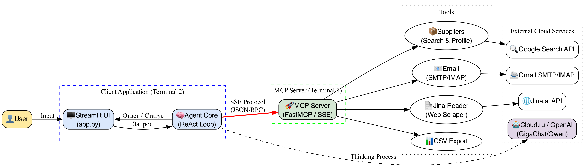
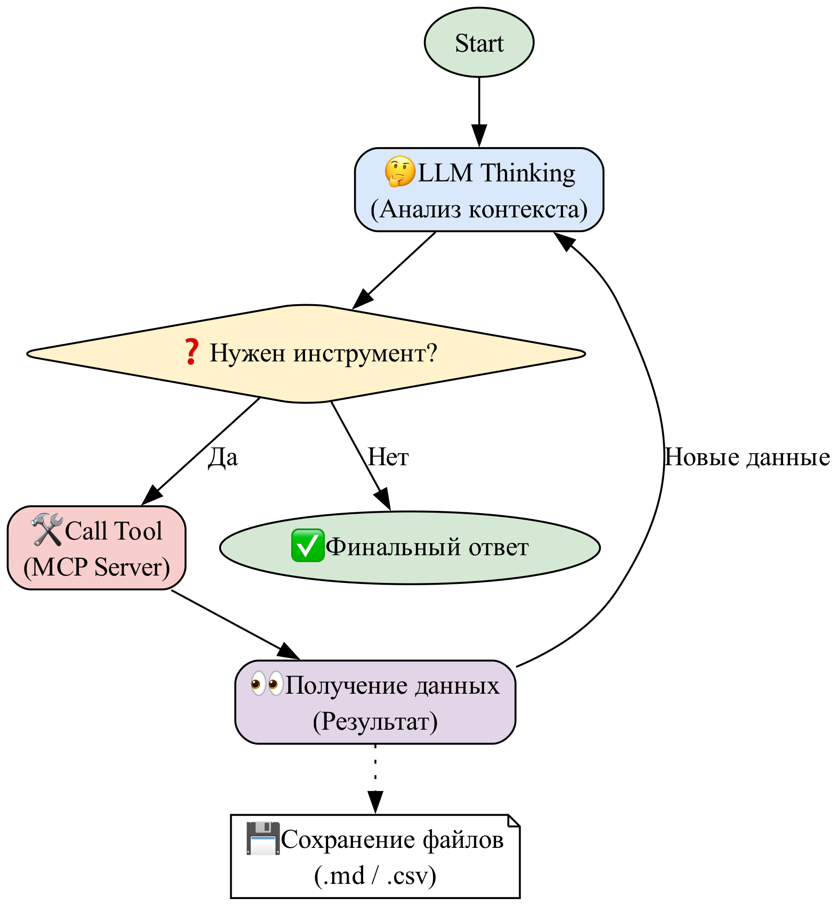

# 🏢 AI Procurement Agent (MCP Based)

Интеллектуальный агент для автоматизации процесса закупок. Проект построен на архитектуре **Model Context Protocol (MCP)** и позволяет искать поставщиков, анализировать их сайты, вести деловую переписку и формировать аналитические отчеты.



## ✨ Возможности

*   **🔍 Умный поиск поставщиков:** Использует Google API для поиска релевантных компаний, отфильтровывая мусорные сайты.
*   **📄 Анализ сайтов:** Читает содержимое веб-страниц (через Jina AI), анализирует ассортимент и условия.
*   **🗂 Генерация досье:** Автоматически создает Markdown-профиль на каждого поставщика в папке `suppliers/`.
*   **📨 Коммуникация:** Умеет писать и отправлять письма поставщикам, а также проверять ответы (SMTP/IMAP).
*   **📊 Экспорт данных:** Формирует сводные таблицы (CSV) с рейтингами и ценами.
*   **🖥️ Web-интерфейс:** Удобный Dashboard на Streamlit с чатом и управлением файлами.

---

## 🛠 Технический стек

*   **Core:** Python 3.11+
*   **LLM:** Cloud.ru GigaChat / Qwen (через OpenAI-compatible API)
*   **Protocol:** [Model Context Protocol (MCP)](https://modelcontextprotocol.io)
*   **Server Framework:** `fastmcp` (SSE Transport)
*   **Frontend:** `streamlit`
*   **External APIs:** Google Custom Search, Jina.ai Reader

---

## 🚀 Установка и Запуск

### 1. Предварительная подготовка

Убедитесь, что у вас установлен Python 3.10 или выше.

```bash
# Клонируйте репозиторий
git clone <your-repo-url>
cd hack_mcp_cloud_ru

# Создайте и активируйте виртуальное окружение
python -m venv .venv
source .venv/bin/activate  # Для Mac/Linux
# .venv\Scripts\activate   # Для Windows

# Установите зависимости
pip install -r requirements.txt
```

### 2. Настройка переменных окружения

Создайте файл `.env` в корне проекта и заполните его ключами:

```ini
# --- LLM API (Cloud.ru) ---
API_KEY=Ваш_Ключ_GigaChat_Или_Qwen

# --- Google Search API ---
GOOGLE_API_KEY=Ваш_Google_API_Key
GOOGLE_CSE_ID=Ваш_Search_Engine_ID

# --- Jina Reader (Web Scraping) ---
JINA_API_KEY=Ваш_Jina_Key

# --- Email (Gmail example) ---
SMTP_SERVER=smtp.gmail.com
SMTP_PORT=587
IMAP_SERVER=imap.gmail.com
IMAP_PORT=993
EMAIL_USER=ваш_email@gmail.com
# Внимание: Используйте App Password (Пароль приложения), а не основной пароль!
EMAIL_PASSWORD=xxxx xxxx xxxx xxxx

# --- Настройки ---
EMAIL_CHECK_TIMEOUT=60
```

### 3. Запуск (Требуется 2 терминала)

Архитектура MCP требует, чтобы Сервер и Клиент работали параллельно.

**Терминал 1: Запуск MCP Сервера**
```bash
python -m mcp_server.server
```
*Ожидаемый вывод:* `🚀 ЗАПУСК СЕРВЕРА... Адрес: http://127.0.0.1:8000/sse`

**Терминал 2: Запуск Интерфейса (Streamlit)**
```bash
streamlit run app.py
```
Приложение откроется в браузере автоматически (обычно http://localhost:8501).

---

## 🧠 Как это работает?

Система работает по циклу **ReAct (Reasoning + Acting)**. Агент получает задачу, "думает", какой инструмент применить, выполняет его на сервере и анализирует результат.



1.  **Пользователь** пишет: *"Найди поставщиков фанеры в Москве"*.
2.  **Агент** вызывает инструмент `find_suppliers` на MCP-сервере.
3.  **Сервер** делает запрос в Google, возвращает список URL.
4.  **Агент** для каждого URL вызывает `read_url`, получает контент сайта.
5.  **Агент** анализирует текст сайта, извлекает цены и контакты, сохраняет файл `.md`.
6.  В конце агент формирует отчет и предлагает скачать CSV.

---

## 📂 Структура проекта

```text
.
├── agent/                  # Клиентская часть (Мозг)
│   ├── app.py              # Интерфейс Streamlit
│   ├── core.py             # Логика агента (ReAct loop, SSE client)
│   └── llm_client.py       # Подключение к LLM
├── mcp_server/             # Серверная часть (Руки)
│   ├── server.py           # Точка входа FastMCP
│   ├── mcp_instance.py     # Инстанс приложения
│   └── tools/              # Инструменты (Tools)
│       ├── suppliers.py    # Логика поиска и профилирования
│       ├── send_email.py   # Работа с почтой
│       ├── web_search.py   # Google Search wrapper
│       └── ...
├── suppliers/              # Папка для сохраненных досье (.md)
├── exports/                # Папка для CSV отчетов
└── .env                    # Секреты и настройки
```

---